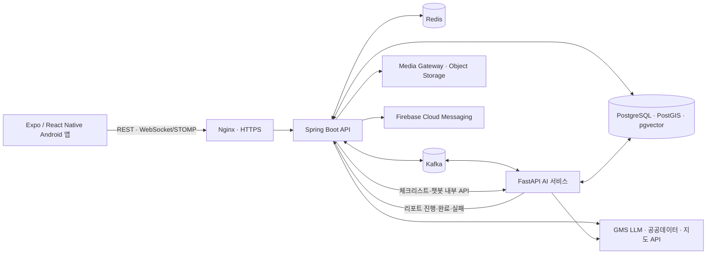

# 싸방팔방

> 아파트를 함께 살펴보고, 현장 기록과 AI 리포트로 비교하는 임장 스터디 앱

싸방팔방은 관심 지역과 아파트를 지도에서 탐색하고, 함께 임장할 사람을 모아 현장 경험을 체계적으로 기록하는 Android 애플리케이션입니다. 임장 중에는 개인 맞춤 체크리스트와 텍스트·사진·음성 기록을 사용하고, 임장 종료 후에는 참여자 기록을 통합한 근거 기반 AI 리포트와 아파트 챗봇을 제공합니다.

- 앱 버전: `1.0.1`
- 저장소 형태: Frontend·Backend·AI·Infra로 구성된 멀티파트 저장소
- 기준일: 2026-08-10

## 목차

- [주요 기능](#주요-기능)
- [시스템 구성](#시스템-구성)
- [기술 스택](#기술-스택)
- [저장소 구조](#저장소-구조)
- [빠른 시작](#빠른-시작)
- [환경변수](#환경변수)
- [테스트와 품질 확인](#테스트와-품질-확인)
- [배포와 운영](#배포와-운영)
- [개발 규칙](#개발-규칙)
- [문서 안내](#문서-안내)

## 주요 기능

### 아파트 탐색

- Mapbox 기반 지도 가시 영역 조회, 키워드·현재 위치 주변 검색
- 서울 구·동 단위 지역 탐색
- 아파트 상세 정보, 최근 실거래가, 모집 중인 스터디와 완료 리포트 조회
- 관심 아파트와 관심 리포트 저장
- 홈 화면 일정·추천·기상 특보 통합 조회

### 회원과 소셜 기능

- 이메일 회원가입·로그인·비밀번호 재설정
- 카카오·네이버 OAuth 로그인과 소셜 회원가입
- JWT Access/Refresh Token 인증과 자동 재발급
- 온보딩, 프로필 수정, 팔로우, 쪽지
- 알림 수신 설정, FCM 기기 토큰 관리, 앱 링크 기반 화면 이동

### 임장 스터디

- 스터디 생성·신청·승인·거절과 모집 조기 마감·재개
- 목표, 소개, 일정, 공지, 멤버와 신청자 관리
- STOMP WebSocket 기반 실시간 채팅과 읽지 않은 메시지 관리
- 채팅·스터디 일정·임장 상태에 연동된 푸시 알림
- 임장 종료 후 스터디원 대상 익명 태그·좋아요 리뷰

### 현장 임장

- GPS 거리 검증을 거친 임장 시작과 참여자 상태 확인
- 아파트 단지 주변 추천 경로 생성, 지도 경로 안내와 실제 이동 경로 기록
- 사용자 특성에 맞춘 AI 체크리스트 생성·선택과 답변 일괄 저장
- 텍스트·사진·음성 현장 기록 등록·수정·삭제
- Kafka 비동기 작업과 Faster Whisper를 이용한 음성 STT, 실패 작업 재처리
- 개인 임장 종료·취소, 미종료 참여자 종료 요청, 과반수 투표 기반 전체 종료

### AI 리포트와 챗봇

- 임장 종료 이벤트를 Kafka로 전달해 AI Report Worker가 비동기로 처리
- 참여자별 체크리스트·메모·STT 기록을 정규화한 통합 리포트 생성
- 공통 의견, 상반된 의견, 추가 확인 항목과 원문 근거 연결
- 처리 lease, 멱등성, 진행 단계, 실패 메타데이터, 재생성, DLT 정책 지원
- PostgreSQL `pgvector`와 다국어 임베딩 기반 RAG 검색
- 내부 리포트·공개 데이터·선택적 웹 검색을 결합한 아파트 챗봇
- GMS 호환 Gemini·OpenAI·Anthropic 모델 비교 평가 도구

### 커뮤니티

- 게시글 목록·검색·상세·작성·수정·삭제
- 댓글 작성·수정·삭제와 게시글 좋아요
- HOT 게시글, 내가 작성한 글·댓글, 사용자 공개 프로필 조회

## 시스템 구성



주요 처리 흐름은 다음과 같습니다.

1. 앱은 Spring Boot의 REST API와 STOMP WebSocket을 통해 인증, 스터디, 임장, 채팅 기능을 사용합니다.
2. Backend는 PostgreSQL을 영속 저장소로, Redis를 STT lease·중복 처리 방지 등 단기 상태 저장소로 사용합니다.
3. 음성 기록과 리포트 생성은 Kafka 요청·결과 토픽으로 Backend와 AI 서비스가 비동기 연동됩니다.
4. AI 서비스는 STT, 체크리스트, 리포트 생성·근거 연결, RAG 검색을 수행하고 내부 API로 결과를 저장합니다.
5. 운영 환경에서는 Nginx가 HTTPS 진입점과 리포트 앱 링크 랜딩을 담당하고 Jenkins가 Docker Compose 배포·검증을 수행합니다.

## 기술 스택

| 영역 | 기술 |
|---|---|
| Mobile | Expo SDK 57, React Native 0.86.2, React 19.2.3, TypeScript 6.0.3, Expo Router |
| Client State | TanStack Query 5, Zustand 5, React Hook Form |
| Map & Device | Mapbox, Turf, Expo Location·Sensors·Notifications·Secure Store |
| Realtime | STOMP WebSocket |
| Backend | Java 17, Spring Boot 3.5.16, Spring Security, Spring Data JPA, Querydsl, Spring Kafka |
| Database | PostgreSQL 17, PostGIS 3, pgvector 0.8.5, Flyway |
| Cache & Messaging | Redis 7.4.9, Apache Kafka 4.3.1 KRaft |
| AI | Python 3.12, FastAPI, Pydantic, SQLAlchemy, aiokafka, sentence-transformers, Faster Whisper |
| API & Auth | REST, OpenAPI/Swagger, JWT, Kakao·Naver OAuth, FCM |
| Infra | Docker Compose, Nginx, Jenkins, AWS EC2 |
| Test | JUnit 5, Spring Boot Test, Testcontainers, pytest, Node test runner |

## 저장소 구조

```text
S15P11A701/
├─ frontend/               # Expo Router 기반 Android 앱
│  ├─ app/                 # 파일 기반 화면·라우팅
│  ├─ src/features/        # 도메인별 UI, API, 훅과 상태 로직
│  ├─ src/store/           # Zustand 전역 상태
│  ├─ assets/              # 이미지, 캐릭터, 날씨 리소스
│  └─ app.config.ts        # Expo·Android·딥링크·네이티브 설정
├─ backend/                # Spring Boot API 서버
│  ├─ src/main/java/       # 도메인, 서비스, 컨트롤러, 연동 어댑터
│  ├─ src/main/resources/  # Profile 설정과 Flyway 마이그레이션
│  └─ src/test/            # 단위·통합·PostgreSQL·Kafka 테스트
├─ ai/                     # FastAPI AI API와 Kafka Worker
│  ├─ app/api/             # 체크리스트·챗봇·RAG 내부 API
│  ├─ app/messaging/       # STT·리포트 Kafka 런타임
│  ├─ app/rag/             # 임베딩·색인·검색
│  ├─ app/evaluation/      # GMS 다중 모델 평가
│  └─ tests/               # 단위·계약·격리 E2E 테스트
├─ infra/                  # Local/Prod Compose, Nginx, 운영 스크립트
├─ contracts/              # Backend↔AI JSON 계약 fixture
├─ docs/                   # API, ERD, 개발, 배포, 설계·검증 문서
├─ onestore-release/       # 원스토어 등록 문구·체크리스트·증빙
├─ Jenkinsfile             # 운영 배포 파이프라인
└─ Jenkinsfile.verify      # develop/브랜치 검증 파이프라인
```

## 빠른 시작

### 1. 사전 준비

| 도구 | 기준 |
|---|---|
| Node.js | 22.13.0 이상 |
| JDK | 17 |
| Docker | Docker Compose 플러그인을 사용할 수 있는 버전 |
| Android SDK | Platform 36, Build-Tools 36.0.0, Emulator |
| Android 가상 기기 | Pixel 8 / API 36 / Google Play 이미지 권장 |

Android 최초 설정은 [frontend 팀원 시작 가이드](frontend/README.md)를 먼저 확인하세요. Mapbox와 소셜 로그인 네이티브 모듈을 사용하므로 Expo Go가 아닌 development build가 필요합니다.

### 2. 로컬 환경변수 준비

저장소 루트에서 예시 파일을 복사합니다.

```powershell
Copy-Item infra\.env.example infra\.env.local
Copy-Item frontend\.env.example frontend\.env.local
```

macOS/Linux에서는 다음 명령을 사용합니다.

```bash
cp infra/.env.example infra/.env.local
cp frontend/.env.example frontend/.env.local
```

`infra/.env.local`의 `JWT_SECRET`은 반드시 32바이트 이상의 Base64 키로 교체해야 합니다. 실제 키, OAuth Secret, Firebase 서비스 계정, GMS 키는 Git·MR·채팅·로그에 남기지 마세요.

Android 에뮬레이터는 개발 PC의 API를 `localhost`가 아닌 `10.0.2.2`로 접근합니다.

```dotenv
EXPO_PUBLIC_API_BASE_URL=http://10.0.2.2:8080
EXPO_PUBLIC_WS_URL=ws://10.0.2.2:8080/ws
```

### 3. PostgreSQL·Redis·Kafka·AI 실행

저장소 루트에서 실행합니다.

```bash
docker compose --env-file infra/.env.local -f infra/docker-compose.local.yml up -d
docker compose --env-file infra/.env.local -f infra/docker-compose.local.yml ps
```

Local Compose는 PostgreSQL, Redis, Kafka, REPORT 토픽 초기화 작업과 FastAPI AI 서비스를 실행합니다. AI 서비스는 `http://localhost:8000/health`에서 확인할 수 있습니다.

### 4. Backend 실행

`infra/.env.local` 자동 import가 `backend/` 작업 디렉터리를 기준으로 동작하므로 반드시 해당 폴더에서 실행합니다.

Windows PowerShell:

```powershell
Set-Location backend
.\gradlew.bat bootRun
```

macOS/Linux:

```bash
cd backend
./gradlew bootRun
```

- Health: `http://localhost:8080/actuator/health`
- Swagger UI: `http://localhost:8080/swagger-ui/index.html`
- OpenAPI JSON: `http://localhost:8080/v3/api-docs`

### 5. Frontend 실행

```bash
cd frontend
npm ci
npm run typecheck
npm run prebuild
npx expo run:android
```

첫 native build 이후 JS/TS만 변경했다면 다시 빌드하지 않고 다음 명령으로 개발합니다.

```bash
npm start
```

환경변수나 Metro 캐시를 갱신해야 할 때는 `npm start -- --clear`를 사용합니다.

### 6. 종료

```bash
docker compose --env-file infra/.env.local -f infra/docker-compose.local.yml down
```

볼륨까지 삭제하는 `down -v`는 로컬 데이터가 모두 제거되므로 의도한 경우에만 사용하세요.

## 환경변수

환경별 실제 값은 커밋하지 않고 예시 파일을 기준으로 개인 환경에서 관리합니다.

| 파일 | 사용 주체 | 주요 설정 |
|---|---|---|
| `infra/.env.local` | Backend·Local Compose·AI | DB, Redis, Kafka, JWT, OAuth, FCM, Media Gateway, STT, REPORT Worker, RAG, GMS |
| `frontend/.env.local` | Expo 앱 | API·WebSocket URL, Mapbox 공개 토큰, Kakao·Naver 앱 식별자, 데모 모드 |
| `ai/.env.local` | AI 단독 실행·평가 | LLM 공급자, GMS 모델 URL, STT, Report Worker, RAG, 웹 검색 |
| `infra/.env.prod` | 운영 Compose | 운영 도메인, 컨테이너, 인증서, 통합 서비스 설정 |

기본 원칙:

- `EXPO_PUBLIC_` 변수는 앱 번들에 포함되므로 비밀값을 저장하지 않습니다.
- `JWT_SECRET`, OAuth Secret, GMS 키, Media Gateway 내부 토큰은 저장소에 커밋하지 않습니다.
- FCM 서비스 계정 JSON은 저장소 밖에 보관하고 경로 또는 Jenkins Secret으로 주입합니다.
- REPORT Kafka Producer와 Worker, RAG 등 운영 기능 플래그는 기본 비활성 상태이며 E2E 검증과 승인 후 함께 활성화합니다.

전체 변수와 선택 기능 설정은 [로컬 개발 환경 문서](docs/LOCAL_DEVELOPMENT.md)와 각 `.env.example`을 참고하세요.

## 테스트와 품질 확인

### Frontend

```bash
cd frontend
npm run typecheck
npm run lint
npm test
npm run doctor
```

### Backend

```bash
cd backend
./gradlew clean test          # Windows: .\gradlew.bat clean test
./gradlew postgresTest        # Docker가 필요한 PostgreSQL Testcontainers 테스트
./gradlew bootJar
```

Spring→Kafka→AI→Kafka STT 왕복 검증은 Local Compose를 실행한 뒤 `sttKafkaE2eTest` 태스크로 수행합니다.

### AI

```bash
cd ai
python -m venv .venv
python -m pip install -r requirements.txt
python -m pytest
```

REPORT·Kafka·Backend 격리 E2E는 각각의 `RUN_REPORT_KAFKA_E2E`, `RUN_REPORT_BACKEND_E2E`, `RUN_STT_KAFKA_E2E` 플래그와 전용 환경이 준비된 경우에만 실행됩니다.

## 배포와 운영

- 운영 서비스는 `infra/docker-compose.prod.yml`의 PostgreSQL, Redis, Kafka, Spring Boot, FastAPI 컨테이너로 구성됩니다.
- Host Nginx가 HTTP→HTTPS 리다이렉트, TLS 종료, API 프록시와 리포트 앱 링크 랜딩을 담당합니다.
- `Jenkinsfile.verify`는 브랜치 변경을 검증하고, `Jenkinsfile`은 운영 환경 검사·이미지 빌드·Compose 배포·Health 확인·외부 Smoke Test를 수행합니다.
- 배포 성공 시 최근 정상 Backend 이미지와 메타데이터를 남겨 수동 복구에 사용합니다.
- PostgreSQL 백업·격리 복구, Kafka Consumer 장애 대응, 로그 비밀값 제거 절차를 운영 스크립트로 관리합니다.

운영 변경 전에는 반드시 [배포·복구 Runbook](docs/INF-006_DEPLOYMENT_RUNBOOK.md)과 [운영 가이드](docs/INF-007_OPERATIONS.md)를 확인하세요.

## 개발 규칙

### 브랜치

- `main`: 운영
- `develop`: 개발 통합
- `feature/*`: 기능 개발
- `release/*`: 배포 준비
- `hotfix/*`: 운영 긴급 수정

### 커밋

| 타입 | 용도 |
|---|---|
| `✨ feat` | 새로운 기능 |
| `🐛 fix` | 버그 수정 |
| `📝 docs` | 문서 수정 |
| `🎨 style` | 동작을 바꾸지 않는 스타일 수정 |
| `♻ refactor` | 리팩터링 |
| `✅ test` | 테스트 추가·수정 |
| `🔧 chore` | 빌드·패키지·도구 설정 |

개인 환경 파일, 실제 인증 키, 서비스 계정, 토큰, 사용자 원문 데이터는 커밋하지 않습니다. 데이터베이스 스키마 변경은 JPA 자동 생성이 아니라 새 Flyway 마이그레이션으로 추가합니다.

## 문서 안내

| 문서 | 내용 |
|---|---|
| [Frontend 시작 가이드](frontend/README.md) | Android SDK·에뮬레이터·development build·문제 해결 |
| [로컬 개발 환경](docs/LOCAL_DEVELOPMENT.md) | Backend, PostgreSQL, Redis, Kafka, AI 상세 실행법 |
| [API 명세](docs/API.md) | REST·WebSocket 요청/응답과 예외 처리 |
| [ERD](docs/ERD.md) | 데이터 모델과 주요 관계 |
| [Android 초기 세팅](docs/ANDROID_SETUP.md) | Expo·네이티브 모듈·EAS·환경변수 설정 |
| [Frontend UI 가이드](docs/FRONTEND_UI_GUIDE.md) | 화면·컴포넌트 UI 규칙 |
| [AI 리포트 입력 계약](docs/AI_REPORT_INPUT_CONTRACT.md) | 리포트 정규화 입력의 소유권과 필드 규칙 |
| [REPORT Kafka 계약](docs/contracts/report-requested-v1.md) | Backend Producer와 AI Consumer 이벤트 계약 |
| [Report Worker 내부 API 계약](docs/contracts/report-worker-backend-v1.md) | 처리권·입력·진행·완료·실패 계약 |
| [모델 평가](docs/MODEL_EVALUATION.md) | GMS 3개 모델 평가 프로파일과 실행법 |
| [배포·복구 Runbook](docs/INF-006_DEPLOYMENT_RUNBOOK.md) | Nginx HTTPS, Jenkins, 배포, 진단과 복구 |
| [운영 가이드](docs/INF-007_OPERATIONS.md) | Kafka, Report Worker, DLT, 백업·복구와 장애 대응 |
| [원스토어 출시 자료](onestore-release/README.md) | 스토어 등록 문구, 이미지, 검수와 릴리스 체크리스트 |
