<h1 align="center">🏠 싸방팔방</h1>

<h3 align="center">
현장 기록부터 체크리스트 · 리포트까지,<br/>
더 나은 임장 경험을 만드는 모바일 임장 스터디 플랫폼
</h3>

<p align="center">
  <b>SSAFY 15기 모바일 트랙 공통 프로젝트 · 6인 팀</b><br/>
  Team Lead · Backend · AI · Infra Integration
</p>

<p align="center">
  <a href="https://drive.google.com/file/d/1cRq3PkYA1P8HrRermupYNuJA8RXNhiV0/view?usp=sharing">
    
  </a>
</p>

<p align="center">
  
  
  
  
  
  
  
  
</p>

<br/>

<table align="center">
  <tr>
    <td align="center">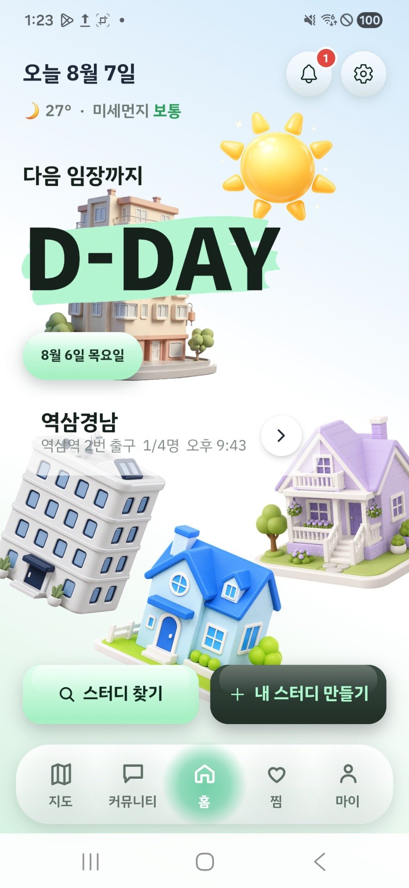</td>
    <td align="center">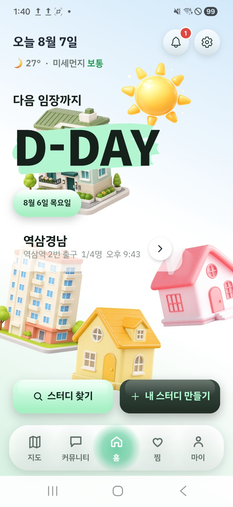</td>
    <td align="center">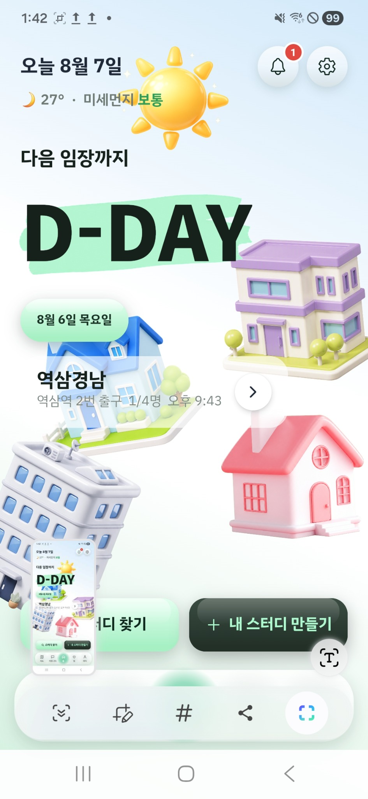</td>
  </tr>
</table>

<br/>

## 📌 Project Highlights

| **109팀 중 10팀** | **본선 발표회 2등** | **228명 사용자 조사** | **6인 팀 · 팀장** |
|:---:|:---:|:---:|:---:|
| 삼성 임직원 유저테스트 선정 | SSAFY 공통 프로젝트 | SSAFY 15/16기 + 부모님/지인 | Backend · AI · Infra 통합 |

> ### 💡 “처리 시작이 아니라 실제 완료까지 확인하는 Backend/Infra 개발자”
>
> API 호출이나 저장 성공만으로 기능이 끝났다고 보지 않았습니다.  
> **DB Commit → 메시지 발행 → Consumer 처리 → Client 반영 → 외부 Endpoint 확인**처럼  
> 시스템 경계마다 무엇이 아직 완료되지 않았는지 구분하고, 실패 조건과 재처리 기준까지 설계했습니다.

### 👩‍💻 프로젝트 한눈에 보기

| 항목 | 내용 |
|---|---|
| **프로젝트** | 싸방팔방 · 모바일 임장 스터디 플랫폼 |
| **트랙** | SSAFY 15기 공통 프로젝트 · 모바일 |
| **팀** | 6인 |
| **역할** | Team Lead · Backend · AI · Infra Integration |
| **성과** | 삼성 임직원 유저테스트 10팀 선정 · 공통 프로젝트 본선 발표회 2등 |
| **핵심 경험** | 실시간 정합성 · 비동기 처리 · 멱등성 · 실패복구 · AI 신뢰성 · CI/CD · 운영 이전 |
| **전체 시연** | [🎬 영상 포트폴리오 보기](https://drive.google.com/file/d/1cRq3PkYA1P8HrRermupYNuJA8RXNhiV0/view?usp=sharing) |

> ℹ️ 이 저장소는 채용 포트폴리오용 공개 Showcase입니다.  
> 비공개 팀 GitLab의 최신 코드에서 공개 가능한 Snapshot을 구성했으며,  
> 아래 내용은 **개인 직접 기여와 팀 전체 구현을 구분해 작성했습니다.**

---

## 📜 목차

1. [프로젝트 소개](#1-프로젝트-소개-)
2. [사용자 문제를 먼저 확인하다](#2-사용자-문제를-먼저-확인하다-)
3. [서비스 시연](#3-서비스-시연-)
4. [실사용자 검증과 영상 포트폴리오](#4-실사용자-검증과-영상-포트폴리오-)
5. [담당 역할 및 협업](#5-담당-역할-및-협업-)
6. [시스템 아키텍처](#6-시스템-아키텍처-)
7. [핵심 설계](#7-핵심-설계-)
8. [트러블 슈팅과 운영 안정성](#8-트러블-슈팅과-운영-안정성-)
9. [테스트와 검증](#9-테스트와-검증-)
10. [기술 구성](#10-기술-구성-)
11. [성과와 프로젝트 활동](#11-성과와-프로젝트-활동-)
12. [What I Learned](#12-what-i-learned-)

---

## 1. 프로젝트 소개 🏘️

### 임장의 전·중·후를 하나의 서비스 흐름으로 연결하다

임장은 실거주나 투자 목적으로 관심 지역과 아파트를 직접 방문해  
교통, 상권, 소음, 시설 등을 확인하는 활동입니다.

하지만 실제 임장 과정에서는 다음 문제가 반복됐습니다.

- **임장 전** — 무엇을 확인해야 하는지 모르기 쉬움
- **임장 중** — 사진·음성·메모·체크리스트 기록이 흩어짐
- **임장 후** — 여러 사람의 기록을 다시 모아 비교하기 어려움
- **후속 탐색** — 리포트를 보고 생긴 궁금증을 다시 검색해야 함

싸방팔방은 이 흐름을 하나로 연결했습니다.

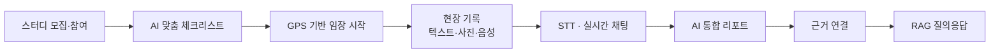
```mermaid
flowchart LR
    A[스터디 모집·참여]
    --> B[AI 맞춤 체크리스트]
    --> C[GPS 기반 임장 시작]
    --> D[현장 기록<br/>텍스트·사진·음성]
    --> E[STT · 실시간 채팅]
    --> F[AI 통합 리포트]
    --> G[근거 연결]
    --> H[RAG 질의응답]
```

기본 도메인은 다음과 같이 단순하게 정의했습니다.

```text
스터디 1개
→ 아파트 1개
→ 일정 1개
→ 임장 1회
→ 팀 리포트 1개
```

---

## 2. 사용자 문제를 먼저 확인하다 🔎

### 기능을 정하기 전에 228명에게 물었습니다

SSAFY 15·16기 교육생뿐 아니라 부모님과 지인까지 범위를 넓혀  
**이틀 동안 총 228명**의 응답을 받았습니다.

<p align="center">
  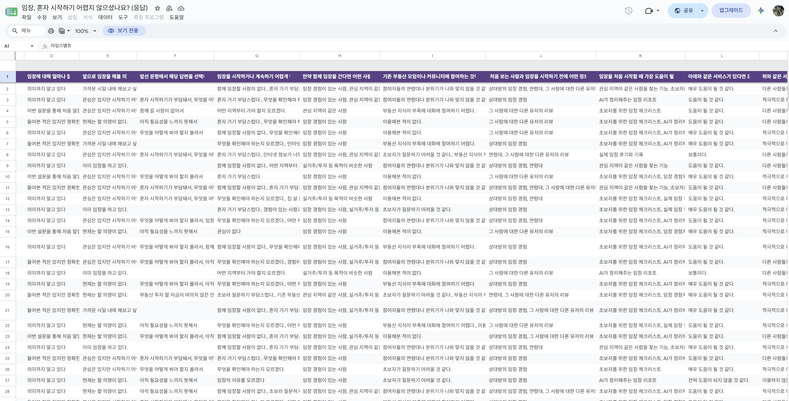
</p>

발표 자료 기준으로 응답자의 **74.4%가 임장에 관심이 있었고**,  
그중 **50.2%는 관심은 있지만 시작하기 어렵다**고 답했습니다.

연령대별로도 불편의 지점이 달랐습니다.

| 사용자 | 확인한 문제 |
|---|---|
| **20·30대** | 임장을 가도 무엇을 봐야 할지 잘 모르겠음 |
| **40·50대** | 현장에서 적은 메모가 흩어져 다시 찾기 어려움 |
| **공통** | 임장 전 준비부터 임장 후 정리까지 한 흐름으로 연결된 도구가 부족함 |

그래서 기능부터 정하지 않고,  
**사용자가 실제로 멈추는 지점을 임장 전·중·후 흐름으로 다시 정의했습니다.**

---

## 3. 서비스 시연 🎬

### 3-1. 홈 · 지도 · 아파트 탐색

임장 일정과 관심 아파트를 한 화면에서 확인하고,  
지도에서 아파트를 탐색한 뒤 상세 정보와 스터디로 이어집니다.

<p align="center">
  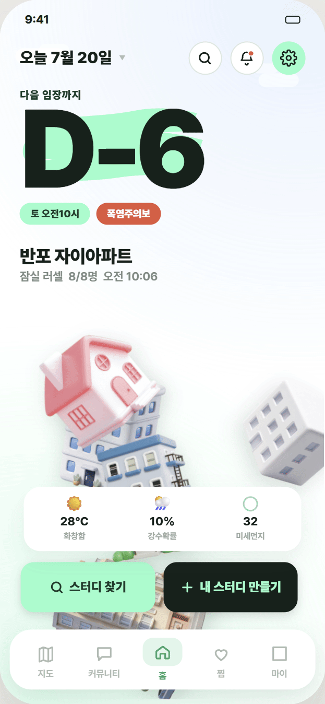
</p>

<table align="center">
  <tr>
    <td align="center">
      <b>아파트 지도</b><br/><br/>
      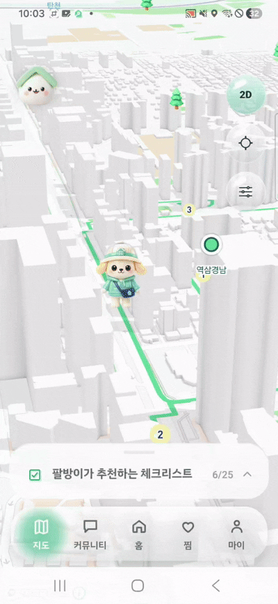
    </td>
    <td align="center">
      <b>아파트 상세</b><br/><br/>
      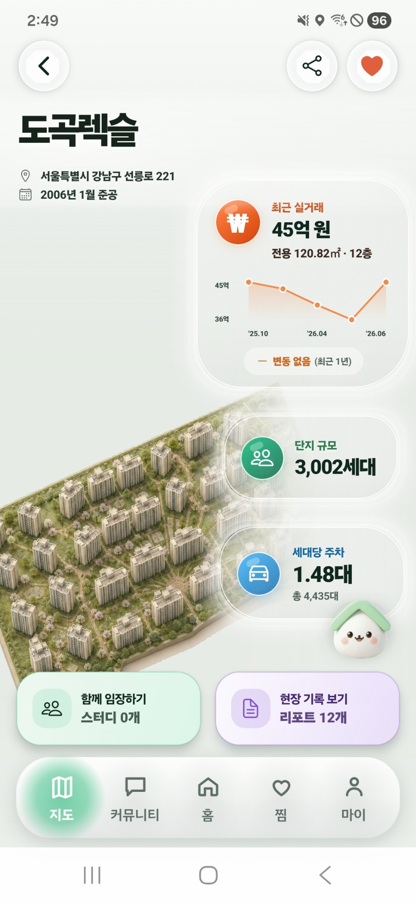
    </td>
  </tr>
</table>

<br/>

### 3-2. 온보딩 → AI 맞춤 체크리스트

온보딩에서 주거 선호 조건을 수집하고,  
임장 시 무엇을 확인해야 할지 사용자 조건에 맞는 체크리스트를 제공합니다.

<table align="center">
  <tr>
    <td align="center">
      <b>온보딩</b><br/><br/>
      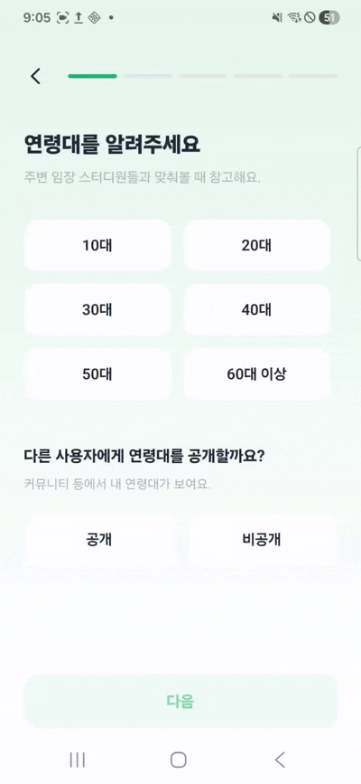
    </td>
    <td align="center">
      <b>체크리스트 생성</b><br/><br/>
      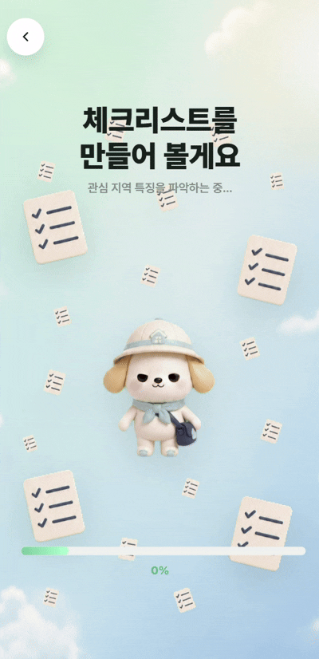
    </td>
  </tr>
</table>

<table align="center">
  <tr>
    <td align="center">
      <b>AI 체크리스트</b><br/><br/>
      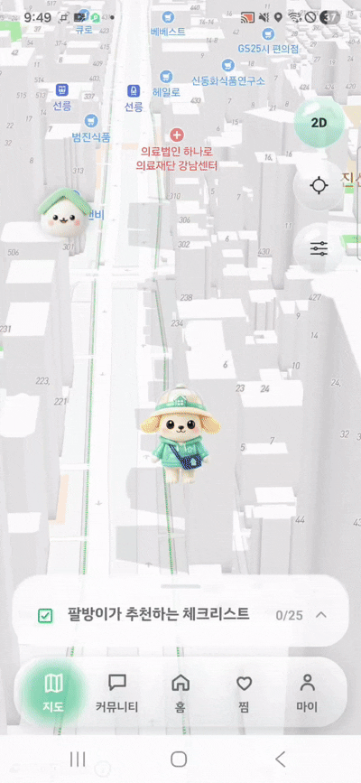
    </td>
    <td align="center">
      <b>체크리스트 · 현장 메모</b><br/><br/>
      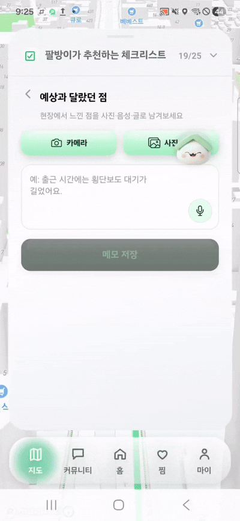
    </td>
  </tr>
</table>

<br/>

### 3-3. 현장 기록 → AI 리포트 → AI 챗봇

현장에서 체크리스트·메모·음성·사진을 남기고,  
임장이 끝나면 여러 참여자의 기록을 하나의 리포트로 종합합니다.

<table align="center">
  <tr>
    <td align="center">
      <b>리포트 생성</b><br/><br/>
      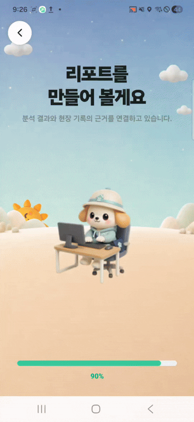
    </td>
    <td align="center">
      <b>AI 리포트</b><br/><br/>
      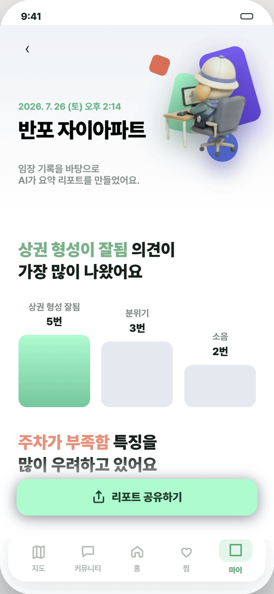
    </td>
  </tr>
</table>

리포트는 체크리스트와 현장 메모를 종합해  
**긍정 요소 · 주의 요소 · 참여자별 원본 근거**를 함께 확인할 수 있도록 구성했습니다.

<p align="center">
  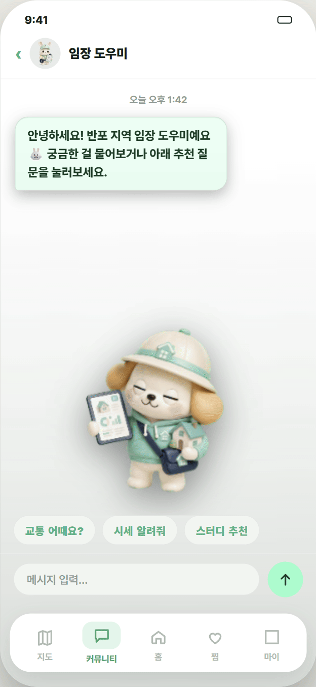
</p>

리포트를 기반으로 추가 질문을 할 수 있도록 RAG 기반 챗봇을 연결했습니다.

<p align="center">
  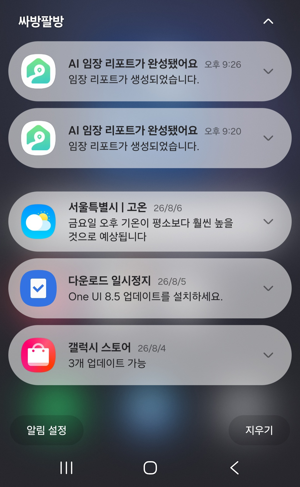
</p>

<br/>

### 3-4. 스터디 · 일정 · 기록 · 리뷰

스터디 모집부터 일정 확인, 참여 기록, 리뷰까지  
임장 전후의 협업 흐름도 앱 안에서 이어집니다.

<table align="center">
  <tr>
    <td align="center">
      <b>스터디 상세</b><br/><br/>
      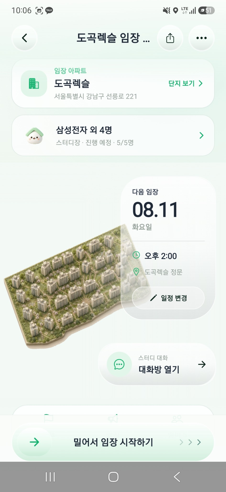
    </td>
    <td align="center">
      <b>일정 캘린더</b><br/><br/>
      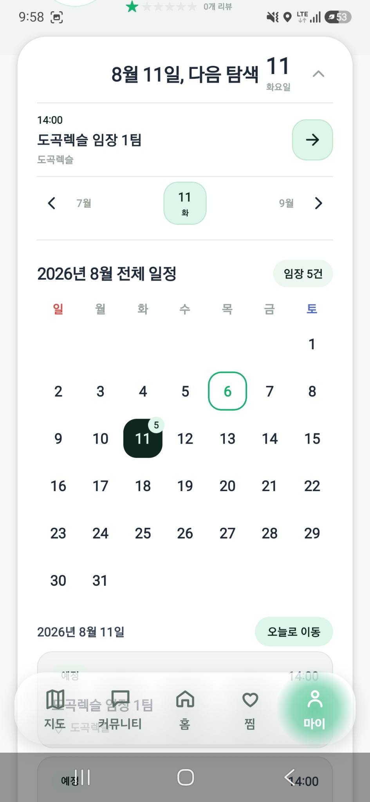
    </td>
    <td align="center">
      <b>참여 스터디</b><br/><br/>
      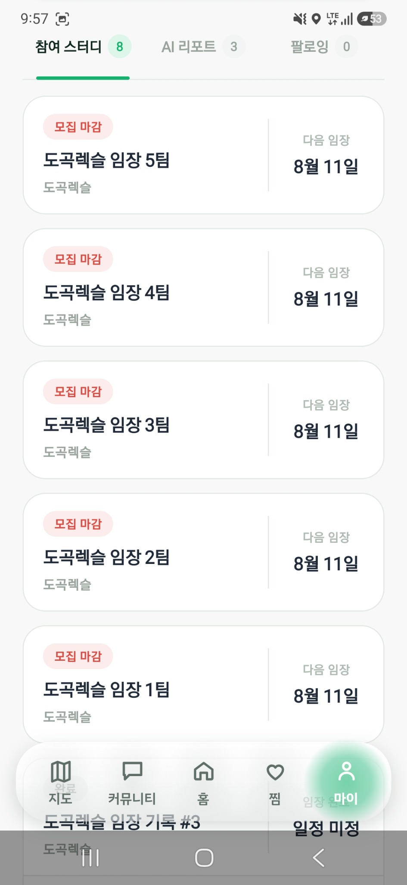
    </td>
  </tr>
</table>

<table align="center">
  <tr>
    <td align="center">
      <b>임장 기록</b><br/><br/>
      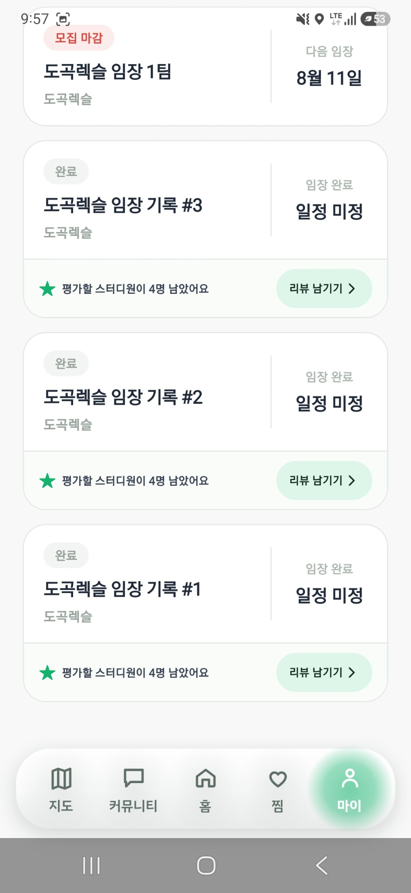
    </td>
    <td align="center">
      <b>리뷰 작성</b><br/><br/>
      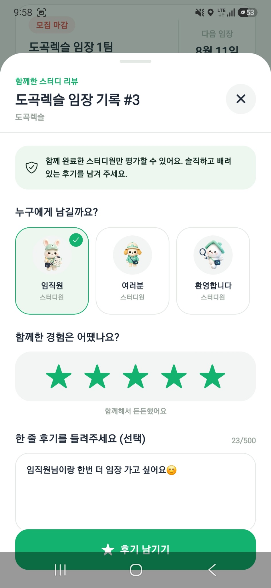
    </td>
    <td align="center">
      <b>리뷰 완료</b><br/><br/>
      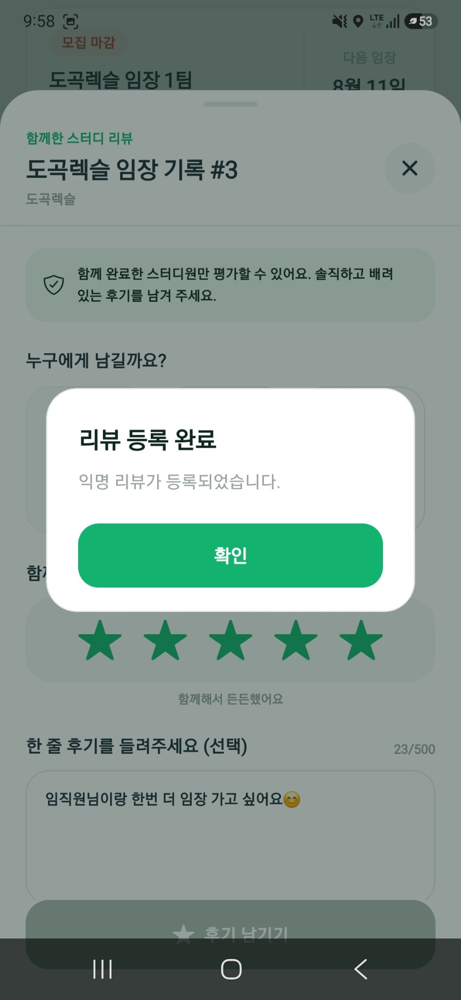
    </td>
  </tr>
</table>

---

## 4. 실사용자 검증과 영상 포트폴리오 📱

### 삼성 임직원 유저테스트 10팀 선정

전체 109팀 중 **삼성 임직원 사용자 테스트 대상 10팀**에 선정되어  
실제 APK를 배포하고 외부 사용자가 직접 서비스를 사용하도록 했습니다.

<p align="center">
  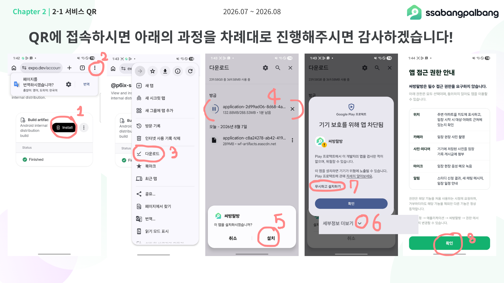
</p>

<p align="center">
  <sub>삼성 임직원 유저테스트 가이드에 실제 APK 설치 경로가 안내된 화면</sub>
</p>

내부에서 기능이 완성됐다고 판단하는 데서 끝내지 않고,  
**실제 사용자가 기능을 끝까지 수행할 수 있는지**를 다시 확인했습니다.

### 🎥 전체 서비스 영상 포트폴리오

<p align="center">
  <a href="https://drive.google.com/file/d/1cRq3PkYA1P8HrRermupYNuJA8RXNhiV0/view?usp=sharing">
    
  </a>
</p>

<p align="center">
  <sub>Google Drive Viewer에서 전체 서비스 흐름을 확인할 수 있습니다.</sub>
</p>

<p align="center">
  
</p>

---

## 5. 담당 역할 및 협업 👩‍💻

### Team Lead · Backend · AI · Infra Integration

6인 팀의 팀장으로 참여해  
개별 기능 하나보다 **Backend · AI · Infra · Mobile 사이의 연결 기준**을 먼저 맞추는 데 집중했습니다.

### 직접 담당한 주요 영역

- 프로젝트 팀장 및 기술 통합
- 요구사항 · ERD · API · 상태 기준 정리
- 초기 Docker Compose 운영 환경 구축
- Jenkins Container · Pipeline · Webhook · Credential · Secret · Nginx/HTTPS 구성
- CI/CD 실패 주입 검증
- Kafka Report Event 계약 · Consumer 정책 · 격리 E2E
- Backup · 격리 Restore 도구
- 운영 DB Flyway 장애 복구
- WebSocket/STOMP 정합성 · 인가 · 읽음 상태 · 이미지 검증
- 현장 기록 `clientRequestId` 기반 멱등성
- GPS 임장 시작 정책 및 150m → 1km 조정
- AI Checklist Fallback · Catalog 선택 구조
- AI Report 결정적 처리 · 근거 검증 · Worker · Lease 계약
- GCP 서버 · 데이터 · 도메인 이전
- 팀 개발 · 운영 · 릴리즈 기준 정리

### 역할 경계를 명확히 했습니다

팀 프로젝트인 만큼 모든 코드를 개인 성과로 설명하지 않습니다.

| 영역 | 개인 역할 |
|---|---|
| **STT Transactional Outbox** | Dual-write 위험 정의 · 도입 제안 · 구조 설계 · 기술 결정 |
| **STT Outbox 실제 코드** | 팀원 구현 |
| **Embedding / pgvector 차원 변경** | 모델·차원 공동 결정 |
| **Frontend UI/Component** | 팀 전체 구현 · 개인 UI 구현으로 귀속하지 않음 |
| **Backend Lease API** | 계약 설계 · Worker 구현 · 통합 E2E 담당, Backend 구현은 팀원 |

> 팀장으로서 중요한 것은 모든 코드를 직접 작성하는 것이 아니라,  
> **구성요소 사이의 실패 조건과 완료 기준을 공통 언어로 만드는 것**이라고 생각했습니다.

---

## 6. 시스템 아키텍처 🏗️

<p align="center">
  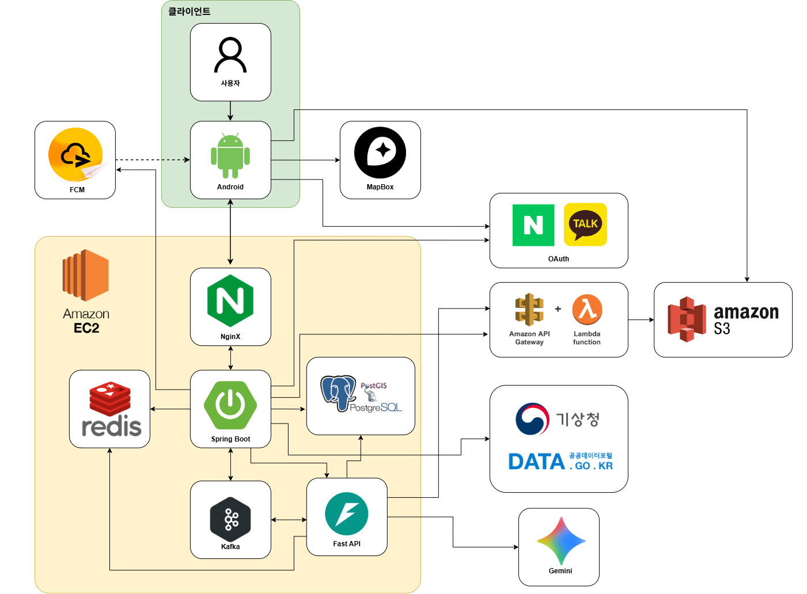
</p>

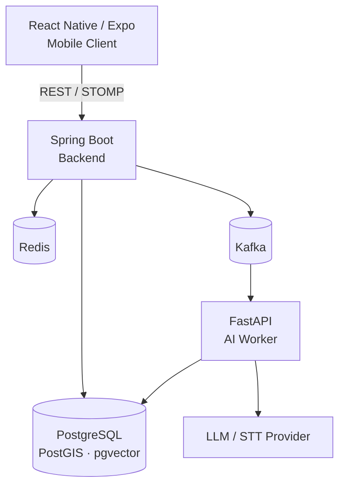
```mermaid
flowchart TB
    Mobile[React Native / Expo<br/>Mobile Client]
    Backend[Spring Boot<br/>Backend]
    DB[(PostgreSQL<br/>PostGIS · pgvector)]
    Redis[(Redis)]
    Kafka[(Kafka)]
    AI[FastAPI<br/>AI Worker]
    LLM[LLM / STT Provider]

    Mobile -->|REST / STOMP| Backend
    Backend --> DB
    Backend --> Redis
    Backend --> Kafka
    Kafka --> AI
    AI --> DB
    AI --> LLM
```

### 주요 데이터 흐름

```text
Mobile
  ↓ REST / STOMP
Spring Boot
  ├─ PostgreSQL / PostGIS / pgvector
  ├─ Redis
  └─ Kafka
        ↓
     FastAPI Worker
        ├─ STT
        ├─ AI Checklist
        ├─ AI Report
        └─ RAG Chatbot
```

### ERD

<details>
<summary><b>ERD 상세 보기</b></summary>

<br/>

<p align="center">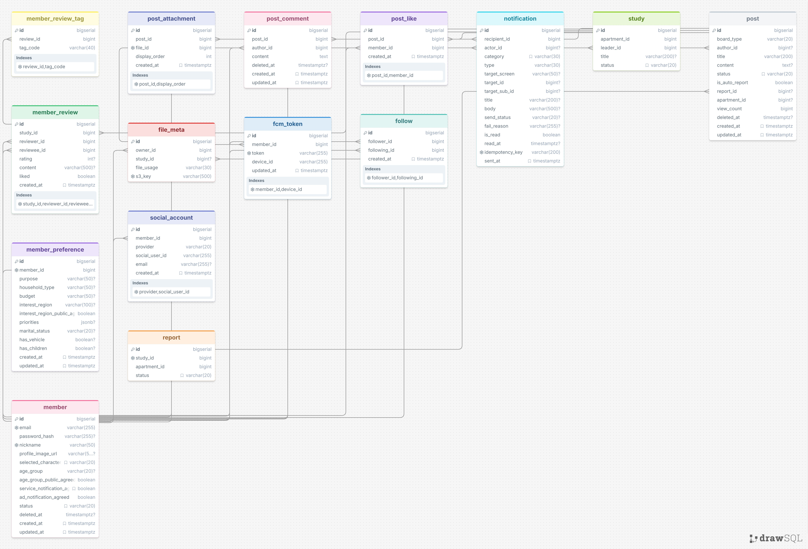</p>
<p align="center">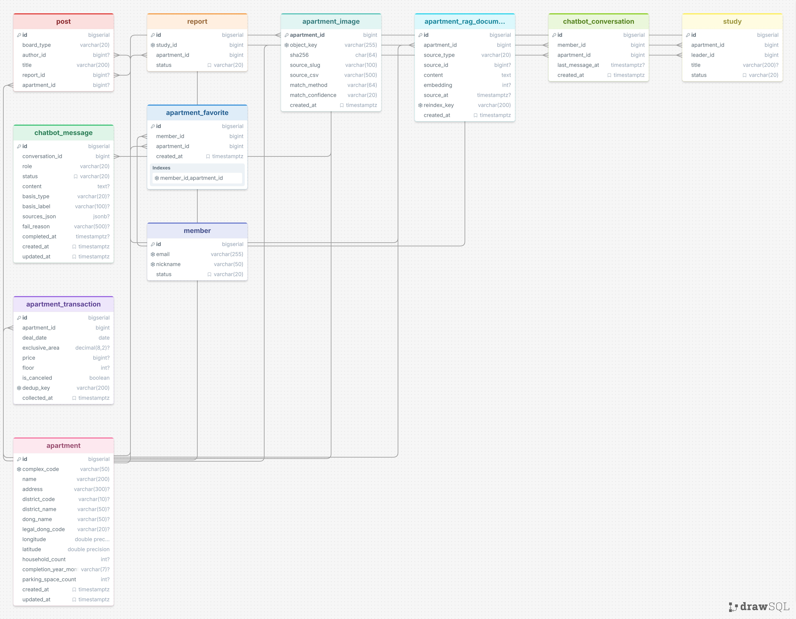</p>
<p align="center">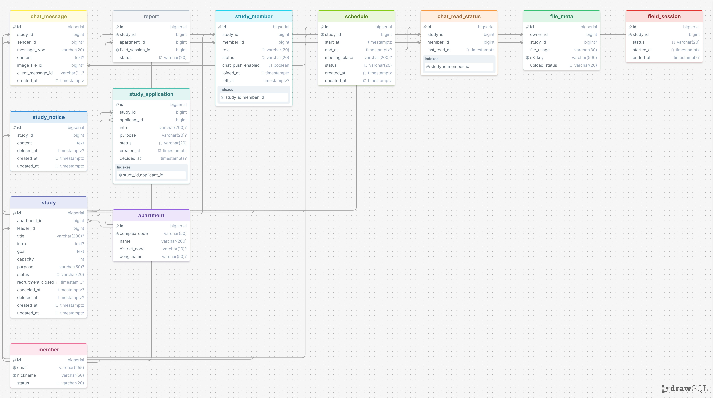</p>
<p align="center">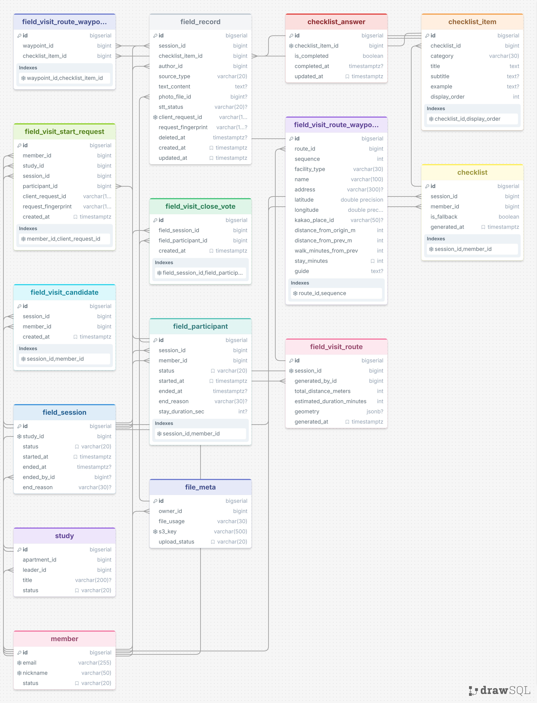</p>
<p align="center">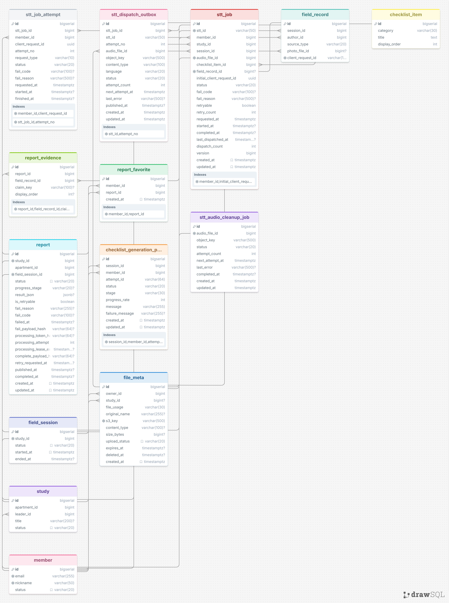</p>

</details>

---

## 7. 핵심 설계 🧩

### 7-1. DB 저장과 실시간 전송을 같은 완료로 보지 않았습니다

채팅 메시지는 DB에 저장되는 순간과  
다른 사용자의 화면에 실시간으로 보이는 순간이 다릅니다.

```text
Entity Save
≠
DB Commit
≠
STOMP Broadcast
≠
Client 화면 반영
```

메시지 저장과 이벤트 생성을 Transaction 안에서 처리하고,  
**실제 STOMP Broadcast는 `AFTER_COMMIT` 이후** 실행하도록 경계를 분리했습니다.

이를 통해 DB가 Rollback됐는데 Client에는 이미 메시지가 보이는 상태를 방지했습니다.

또한 최초 진입 시에는 다음 공백도 따로 다뤘습니다.

```text
REST History 조회
        ↓
STOMP Subscribe
```

두 단계 사이에 도착한 메시지가 처음 화면에서 빠질 수 있어  
**Subscription 이후 Catch-up 조회 + `messageId` 기준 Merge**로 보완했습니다.

> `AFTER_COMMIT`은 DB Commit 이후에 보내도록 할 뿐,  
> 실제 네트워크 전달 성공까지 보장한다고 설명하지 않습니다.

---

### 7-2. 불안정한 네트워크의 재전송을 멱등하게 수용

현장에서는 같은 요청이 재전송될 수 있습니다.

그래서 현장 기록 생성에

```text
clientRequestId
+
SHA-256 Request Fingerprint
+
DB UNIQUE
```

를 사용했습니다.

| 상황 | 처리 |
|---|---|
| 같은 Key + 같은 내용 | 기존 결과 반환 |
| 같은 Key + 다른 내용 | Key 재사용 오류 |
| 동시 중복 요청 | UNIQUE 충돌 후 별도 Transaction에서 기존 결과 재조회 |

단순히 “같은 ID면 성공”으로 처리하지 않고  
**동일 요청의 재시도와 다른 요청의 잘못된 Key 재사용을 구분**했습니다.

---

### 7-3. 현장 통제 목적은 유지하고 GPS 정책은 실제 임장에 맞게 조정

초기 임장 시작 가능 거리는 아파트 중심 기준 **150m**였습니다.

하지만 실제 임장은 단지 안만 보는 것이 아니라  
역·상권·학교·접근 동선까지 함께 확인합니다.

거리 검증 자체를 제거하지 않고,

```text
원격 임장 방지
+
실제 생활권 탐색 가능
```

을 함께 만족시키도록 **1km**로 정책 경계를 조정했습니다.

> 1km를 정량 실험의 최적값이라고 주장하지 않습니다.  
> 핵심은 숫자 자체보다 **통제 목적과 사용자 행동을 함께 본 정책 판단**입니다.

---

### 7-4. LLM의 역할을 “생성”에서 “검증 가능한 선택”으로 제한

초기에는 LLM이 체크리스트 항목을 자유롭게 생성했습니다.

서비스 안정성을 높이기 위해 출력 공간을 제한했습니다.

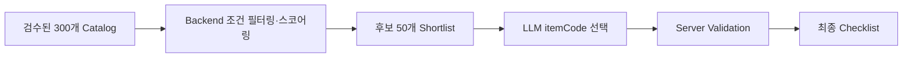
```mermaid
flowchart LR
    A[검수된 300개 Catalog]
    --> B[Backend 조건 필터링·스코어링]
    --> C[후보 50개 Shortlist]
    --> D[LLM itemCode 선택]
    --> E[Server Validation]
    --> F[최종 Checklist]
```

검증 항목:

- 반환 Code가 Shortlist의 부분집합인지
- 중복 Code가 없는지
- 요청한 개수 범위인지
- 알 수 없는 Code가 포함되지 않았는지

실패 시에는 다음 순서로 Fallback합니다.

```text
AI 선택 실패
→ 스코어 상위 결정적 선택
→ 기본 체크리스트
```

> LLM의 환각을 “없앴다”고 표현하지 않고,  
> **카탈로그 밖 출력을 최종 결과에서 거부할 수 있게 만들었다**고 설명합니다.

---

### 7-5. AI 리포트 Worker에 처리권과 실패 상태를 명시

Kafka의 at-least-once 특성상 동일 이벤트가 다시 들어오거나,  
처리 중 Worker가 죽을 수 있습니다.

AI Report Worker는 처리 단계를 명시적으로 관리했습니다.

```text
Acquire
→ RECORD_COLLECTION
→ STT_VALIDATION
→ NORMALIZATION
→ REPORT_GENERATION
→ EVIDENCE_MAPPING
→ RESULT_SAVING
→ COMPLETED
```

Backend와 AI가 다른 언어와 프로세스에서 동작하므로  
먼저 **Lease 계약**을 정의했습니다.

```text
ACQUIRED
→ processingToken + processingAttempt

Lease 유효
→ ALREADY_PROCESSING

Lease 만료
→ 새 Token으로 재선점

이전 Token의 늦은 쓰기
→ STALE_PROCESSING_TOKEN 거부
```

개인 역할은 **계약 설계 · Worker 측 구현 · 통합 E2E**이며,  
Backend Lease API 자체는 팀원이 계약에 맞춰 구현했습니다.

---

### 7-6. STT의 DB 저장과 Kafka 발행 사이 실패 구간을 먼저 정의

STT 요청에서는 다음 두 성공이 서로 다릅니다.

```text
DB에 STT Job 저장 성공
≠
Kafka Request 발행 성공
```

따라서 DB와 Broker 사이의 Dual-write 위험을 정의하고  
**Transactional Outbox 도입을 제안하고 구조를 설계했습니다.**

```text
Business Transaction
├─ STT Job
└─ Outbox Record
       ↓
Dispatcher
       ↓
Kafka
```

> Outbox의 Entity · Migration · Dispatcher · Retry 실제 구현은 팀원이 담당했습니다.  
> 또한 Outbox가 Exactly-once를 보장한다고 설명하지 않습니다.

---

## 8. 트러블 슈팅과 운영 안정성 🛠️

### ⭐ 01. 운영 DB Flyway 이력을 기준으로 배포 복구

6명이 병렬 개발하면서 Migration Version이 겹쳤고,  
Repository의 V23~V25와 운영 DB의 실제 적용 이력이 어긋났습니다.

Jenkins 실패를 Pipeline 문제로만 보지 않고 다음 순서로 원인을 좁혔습니다.

```text
Jenkins 배포 실패
→ Spring Boot 기동 실패
→ Flyway Validation
→ flyway_schema_history
→ Repository Migration Chain
```

운영 History를 삭제하거나 조작하지 않고  
**이미 적용된 운영 이력을 기준선으로 V23 → V24 → V25를 재구성**했습니다.

결과적으로 Flyway Validation 차단이 해소되고  
Spring Boot 기동과 Jenkins 배포 경로가 다시 정상화됐습니다.

> 이후부터 **“적용된 Migration은 수정하지 않고 새 Version으로 누적한다”**는 기준을 문서화했습니다.

---

### ⭐ 02. 안전장치를 “존재”가 아니라 실패 주입으로 검증

Jenkins Pipeline에 Test Stage가 있다고 해서  
실패 시 실제 배포가 중단된다고 가정하지 않았습니다.

운영 Job과 분리된 검증 Branch · Job을 만들고  
의도적으로 실패하는 테스트를 주입했습니다.

실제 확인 결과:

| 검증 항목 | 결과 |
|---|---|
| Checkout | 성공 |
| Configuration Validation | 성공 |
| Gradle Test | **36 completed · 1 failed · 4 skipped** |
| Docker Build | exit code 1 |
| Deploy | **Skipped** |
| Verify Deployment | **Skipped** |
| Jenkins | `FAILURE` |
| 기존 운영 Container | Healthy 유지 |
| 외부 Health Check | `UP` 유지 |

즉, **자동 Rollback을 구현한 것이 아니라 실패한 변경이 Deploy 단계로 넘어가지 않는 것을 직접 검증**했습니다.

---

### ⭐ 03. SSAFY 서버 회수 후 서비스 전체를 GCP로 이전

기존 서버를 더 이상 사용할 수 없게 되면서  
서비스를 장기 보존하기 위해 GCP 이전을 전담했습니다.

```text
DB·파일 보존
→ 새 PostgreSQL 연결
→ Redis / Kafka
→ Spring Boot
→ FastAPI
→ Nginx / Domain
→ TLS
→ HTTPS / WSS
→ 외부 Endpoint 확인
```

Container가 올라온 것만으로 이전 완료라고 보지 않고  
**데이터 · Kafka · AI · HTTPS/WSS · 외부 접근까지 단계별로 확인**했습니다.

이 과정에서 Kafka와 AI의 문제를 각각 분리해 복구하고  
새 Domain 기준의 서비스 접근 경로를 다시 연결했습니다.

---

### 04. Report Consumer는 “모든 실패를 DLT로 보내지 않는다”

잘못된 인증이나 계약 오류까지 DLT로 보내고 Offset을 Commit하면  
복구되지 않은 메시지가 사라진 것처럼 보일 수 있습니다.

그래서 처리 결과별 정책을 구분했습니다.

| 실패 유형 | DLT | Offset Commit | 동작 |
|---|:---:|:---:|---|
| 정상 처리 | - | O | 다음 메시지 |
| 안전한 malformed | O | O | DLT ACK 후 진행 |
| 잘못된 Internal Token | X | X | Partition 차단 |
| Schema/Contract 오류 | X | X | Fail-closed |
| DLT 발행 실패 | X | X | 차단 |

DLT에도 원문 대신 안전한 Metadata와 `payloadHash`만 남기도록 했습니다.

---

## 9. 테스트와 검증 🧪

### “동작한다”보다 실패했을 때 어떻게 끝나는지를 확인했습니다

리포트 파이프라인은 운영 자원에 접근하지 않는 격리 환경에서  
정상·중복·재시작·영구 실패·인증 실패·Malformed Message 등을 검증했습니다.

### 기록된 최종 실행 결과

| 검증 | 결과 |
|---|---:|
| Backend `postgresTest` | **8 passed** |
| AI 경량 pytest | **504 passed / 6 skipped** |
| Kafka-only E2E | **3 passed** |
| Backend + PostgreSQL + Kafka E2E | **7 passed** |
| E2E 시나리오 | **8종** |
| Compose Config | **4종 exit 0** |

8개 시나리오 중 2개가 하나의 통합 테스트로 묶여  
실행 단위로는 7개의 E2E Test가 수행됐습니다.

주요 검증 범위:

- 정상 리포트 완료
- 데이터 부족을 정상 DONE으로 처리
- 영구 실패 상태 저장
- FAILED 상태 중복 Event 재처리 방지
- 잘못된 Internal Token → Commit/DLT 없이 차단
- Worker 재시작 후 동일 Consumer Group 재처리
- Malformed Message → 안전한 DLT
- DLT ACK 실패 → Commit하지 않고 차단

> 테스트는 “통과 개수”보다  
> **어떤 실패 조건을 실제로 실행해봤는지**를 중요하게 봤습니다.

---

## 10. 기술 구성 🛠️

| 영역 | 기술 |
|---|---|
| **Backend** | Java 17 · Spring Boot 3 · Spring Security · JWT · JPA · QueryDSL · WebSocket/STOMP · FCM |
| **Database** | PostgreSQL · PostGIS · pgvector · Flyway |
| **Messaging** | Kafka |
| **Cache** | Redis |
| **AI** | Python · FastAPI · LLM Provider · OpenAI Whisper · RAG |
| **Embedding** | multilingual-e5-small-ko-v2 · 384 dimensions · CPU |
| **Mobile** | React Native · Expo · TypeScript · Mapbox |
| **Infra** | Docker · Docker Compose · Nginx · HTTPS/Certbot · AWS EC2 → GCP |
| **CI/CD** | Jenkins · GitLab Webhook |
| **Collaboration** | Jira · Confluence · GitLab Merge Request |

> 기술 구성은 **프로젝트 전체 기준**입니다.

### Repository 구조

```text
ssabangpalbang-showcase/
├─ frontend/      # React Native / Expo
├─ backend/       # Spring Boot
├─ ai/            # FastAPI / Worker / RAG
├─ infra/         # Docker Compose / Nginx / E2E
├─ contracts/     # Backend ↔ AI Contract
├─ docs/          # API / Operation / Design Docs
├─ ERD/
└─ assets/        # Portfolio UI / Research / Team
```

---

## 11. 성과와 프로젝트 활동 🏆

### 🥈 SSAFY 공통 프로젝트 본선 발표회 2등

전체 109팀 중 삼성 임직원 유저테스트 10팀에 선정됐고,  
반 대표로 본선 발표회에 진출해 **2등**을 기록했습니다.

<p align="center">
  
</p>

<p align="center">
  <sub>본선 발표회를 앞두고 전 캠퍼스 대상으로 서비스 발표와 시연을 리허설하는 모습</sub>
</p>

### 📸 SSAFY CSR 달력 촬영

프로젝트 활동 이후 SSAFY 대표로 삼성전자 CSR 달력 촬영에도 참여했습니다.

<table align="center">
  <tr>
    <td align="center">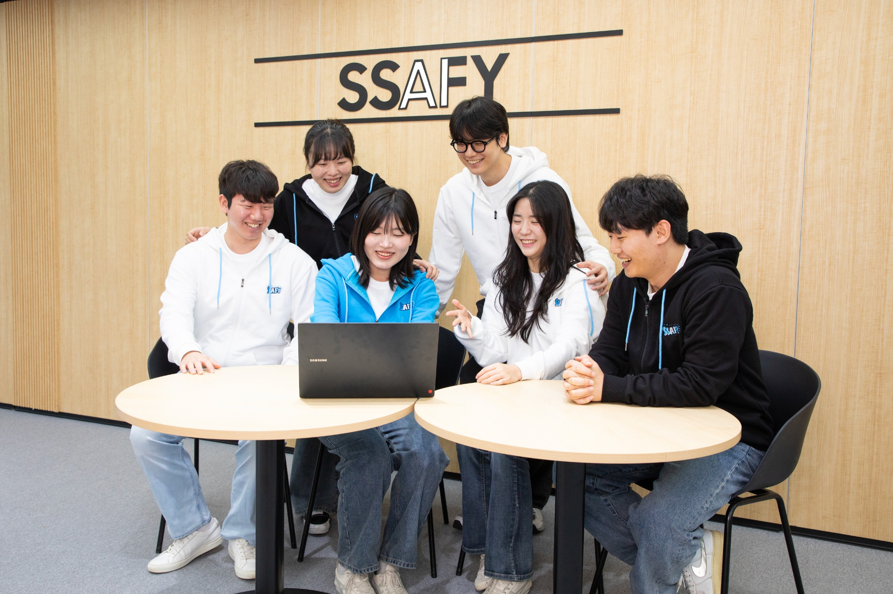</td>
    <td align="center">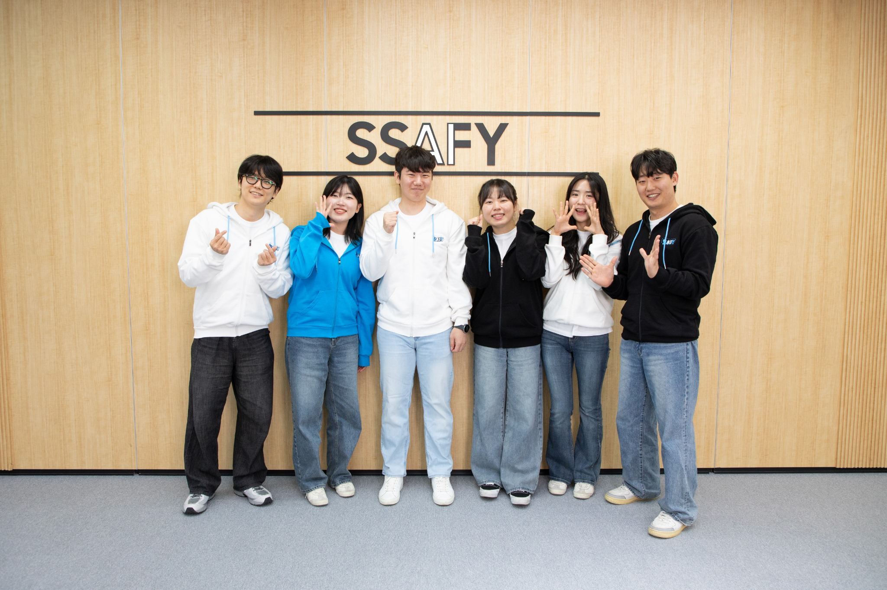</td>
    <td align="center">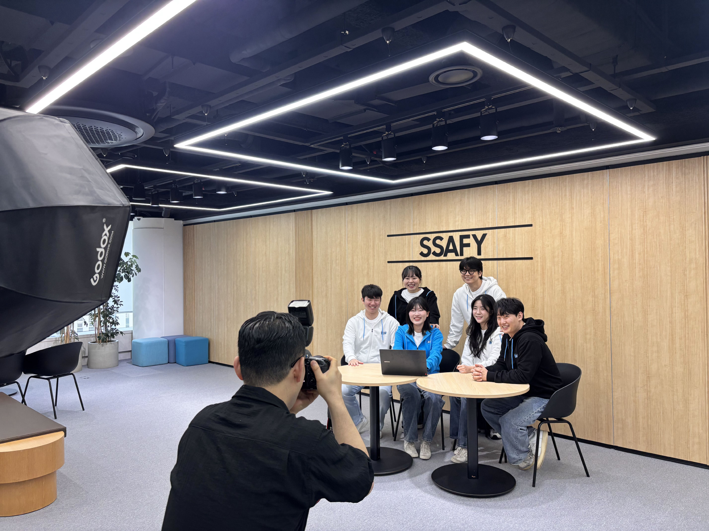</td>
  </tr>
  <tr>
    <td align="center">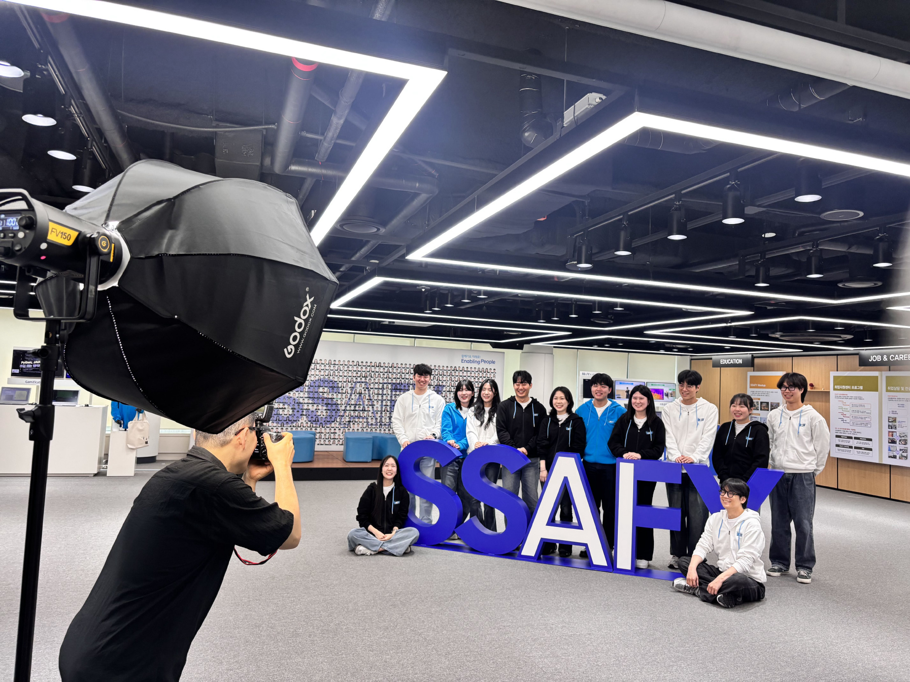</td>
    <td align="center">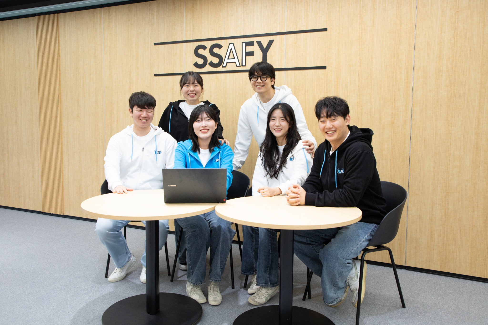</td>
    <td align="center"><b>싸방팔방<br/>P6IX</b></td>
  </tr>
</table>

---

## 12. What I Learned 💭

싸방팔방에서 가장 크게 배운 것은  
**“성공”과 “완료”를 하나의 상태로 뭉개면 안 된다**는 점입니다.

서비스 하나에서도 완료 기준은 여러 단계로 나뉘었습니다.

| 경계 | 제가 확인한 질문 |
|---|---|
| **DB** | 저장 호출이 아니라 실제 Commit까지 끝났는가? |
| **Kafka** | DB 저장 뒤 Message 발행 의무가 남아 있지 않은가? |
| **Consumer** | 실패했는데 Offset을 Commit해도 되는가? |
| **실시간 통신** | DB Commit 전 메시지가 Client에 노출되지 않는가? |
| **Client** | DB에는 있지만 현재 화면에는 빠지는 공백이 없는가? |
| **AI** | LLM 결과를 그대로 믿지 않고 Code로 검증할 수 있는가? |
| **CI/CD** | Test Stage가 있는 것이 아니라 실제 실패 시 Deploy가 막히는가? |
| **운영** | Container가 켜진 것이 아니라 외부에서 서비스가 다시 동작하는가? |

이 기준은 Flyway 장애 복구, Kafka Consumer, 실시간 채팅,  
현장 기록 멱등성, AI Worker, CI/CD 실패 주입, GCP 이전까지 반복해서 적용됐습니다.

> ### 처리 시작이 아니라 **실제 완료까지 확인하고, 실패 시 동작까지 설계하는 Backend/Infra 개발자**
>
> 싸방팔방을 통해 가장 분명해진 개발 기준입니다.

---

<p align="center">
  <b>SSAFY 15th · Mobile Track</b><br/>
  Team Lead · Backend / AI / Infra Integration<br/>
  <b>윤다인</b>
</p>
