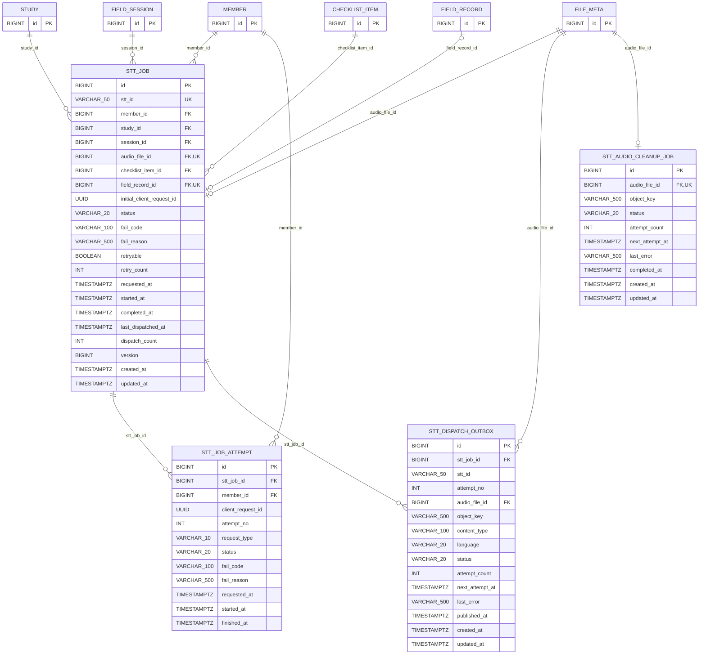

# 데이터베이스 ERD

DB 스키마의 기준은 `backend/src/main/resources/db/migration` 아래의 Flyway
마이그레이션이다. 이 문서는 기존 통합 ERD에 추가해야 하는 STT 비동기 처리 영역을
정리한다.

## STT 비동기 처리

- `V5__add_stt_job_tables.sql`: STT 작업과 요청 시도 이력
- `V14__add_stt_reliability_jobs.sql`: Kafka 발행 아웃박스와 음성 원본 삭제 재시도 작업

### V14 제약 조건과 인덱스

| 테이블 | 구분 | 이름 | 정의 |
| --- | --- | --- | --- |
| `stt_dispatch_outbox` | FK | 자동 생성 | `stt_job_id -> stt_job.id` |
| `stt_dispatch_outbox` | FK | 자동 생성 | `audio_file_id -> file_meta.id` |
| `stt_dispatch_outbox` | UNIQUE | `uk_stt_dispatch_outbox_attempt` | `(stt_id, attempt_no)` |
| `stt_dispatch_outbox` | CHECK | `ck_stt_dispatch_outbox_attempt_no` | `attempt_no >= 1` |
| `stt_dispatch_outbox` | CHECK | `ck_stt_dispatch_outbox_attempt_count` | `attempt_count >= 0` |
| `stt_dispatch_outbox` | CHECK | `ck_stt_dispatch_outbox_status` | `status IN (PENDING, PUBLISHED, FAILED)` |
| `stt_dispatch_outbox` | INDEX | `idx_stt_dispatch_outbox_ready` | `(status, next_attempt_at, id)` |
| `stt_audio_cleanup_job` | FK | 자동 생성 | `audio_file_id -> file_meta.id` |
| `stt_audio_cleanup_job` | UNIQUE | `uk_stt_audio_cleanup_file` | `(audio_file_id)` |
| `stt_audio_cleanup_job` | CHECK | `ck_stt_audio_cleanup_attempt_count` | `attempt_count >= 0` |
| `stt_audio_cleanup_job` | CHECK | `ck_stt_audio_cleanup_status` | `status IN (PENDING, COMPLETED, FAILED)` |
| `stt_audio_cleanup_job` | INDEX | `idx_stt_audio_cleanup_ready` | `(status, next_attempt_at, id)` |

`stt_dispatch_outbox.(stt_id, attempt_no)`는
`stt_job.stt_id`와 `stt_job_attempt.attempt_no` 조합을 논리적으로 가리킨다.
두 테이블을 함께 참조하는 복합 FK는 두지 않고, 아웃박스의 UNIQUE 제약으로 같은
시도의 중복 발행 레코드를 방지한다.

### V14 적용 시 데이터 보정

- V14 적용 시 이미 `PENDING`인 STT 작업은 최신 `stt_job_attempt` 기준으로
  `stt_dispatch_outbox`에 등록한다.
- STT 작업이 `DONE`이고 `file_meta.upload_status = DELETED`인 음성 파일은
  `stt_audio_cleanup_job`에 등록해 실제 오브젝트 삭제를 재시도할 수 있게 한다.
- 두 보정 쿼리는 `ON CONFLICT DO NOTHING`을 사용하므로 동일 대상을 중복 생성하지
  않는다.
- 애플리케이션 시작 후 아웃박스는 `STT_RELIABILITY_ENABLED`와
  `STT_KAFKA_ENABLED`가, 삭제 작업은 `STT_RELIABILITY_ENABLED`와
  `MEDIA_GATEWAY_ENABLED`가 모두 활성화된 환경에서 처리된다.

### 마이그레이션 버전 변경 주의

STT 신뢰성 마이그레이션은 최초 브랜치 작업에서 `V12`로 추가됐다가 develop의
`V12`, `V13`과 합치면서 현재 `V14`로 변경됐다.

- 예전 STT용 `V12`를 적용하지 않은 환경은 현재 마이그레이션 순서대로 적용하면 된다.
- 예전 STT용 `V12`를 적용한 폐기 가능한 로컬 DB는 DB 또는 볼륨을 다시 생성한 뒤
  현재 `V1`~`V14`를 처음부터 적용한다.
- 예전 STT용 `V12`가 공유·보존 환경에 적용됐다면 애플리케이션을 바로 재기동하지
  않는다. `flyway_schema_history`와 두 신규 테이블의 존재 여부를 확인한 뒤 별도
  보정 절차를 합의해야 한다.
- `flyway repair`만 실행하면 이미 생성된 테이블과 현재 `V14`의 충돌을 해결하지
  못하므로 단독 대응으로 사용하지 않는다.
